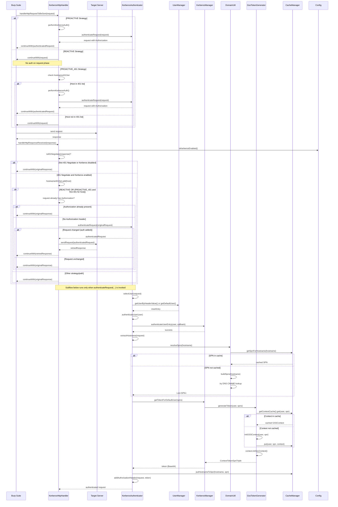

# KerberAuth Architecture Documentation

This document provides a comprehensive overview of the KerberAuth Burp extension requests processing.

---

## 2. HTTP Request Processing Flow

This sequence diagram illustrates the complete flow of processing an HTTP request with Kerberos authentication, showing interactions between all components.

### Processing Steps:

1. **Request Interception**: Burp sends request to handler
2. **Strategy Evaluation**: 
   - PROACTIVE: Always authenticate
   - REACTIVE: Wait for 401 Negotiate response
   - PROACTIVE_401: Authenticate only for hosts that previously returned 401
3. **User Selection**: Choose user based on custom header (e.g., PwnFox) or default user
4. **Authentication**: Ensure user has valid TGT (Ticket Granting Ticket)
5. **SPN Resolution**: 
   - Check SPN cache
   - Try DNS CNAME lookup
   - Build list of candidate SPNs
6. **Token Generation**:
   - Check context cache for existing GSS context
   - Initialize new GSS context if needed
   - Generate SPNEGO token via `initSecContext()`
7. **Caching**: Store successful SPN mapping and GSS context
8. **Header Addition**: Add `Authorization: Negotiate <token>` header
9. **Request Forwarding**: Send authenticated request to target

### Cache Optimization:

The flow leverages multiple cache levels to minimize redundant operations:
- **hostname → SPN mapping**: Avoids DNS lookups and SPN trial-and-error
- **GSS Context cache**: Reuses established security contexts
- **Working set**: Tracks recently successful SPNs/hosts

---

## 5. Detailed Request Processing Flow

This comprehensive flowchart shows every decision point and action in the request processing pipeline.

```mermaid
flowchart TD
    START([HTTP Request arrives]) --> CHECK_ENABLED{Kerberos<br/>enabled?}
    
    CHECK_ENABLED -->|No| SEND_ORIG[Send original<br/>request]
    CHECK_ENABLED -->|Yes| CHECK_SCOPE{Host in<br/>scope?}
    
    CHECK_SCOPE -->|No| SEND_ORIG
    CHECK_SCOPE -->|Yes| CHECK_STRATEGY{Which<br/>strategy?}
    
    CHECK_STRATEGY -->|PROACTIVE| DO_AUTH[Authenticate<br/>now]
    CHECK_STRATEGY -->|REACTIVE| SEND_ORIG
    CHECK_STRATEGY -->|PROACTIVE_401| CHECK_401{Host in<br/>401 list?}
    
    CHECK_401 -->|Yes| DO_AUTH
    CHECK_401 -->|No| SEND_ORIG
    
    DO_AUTH --> CHECK_HEADER{Authorization<br/>header exists?}
    CHECK_HEADER -->|Yes| SEND_ORIG
    CHECK_HEADER -->|No| SELECT_USER[Select<br/>user]
    
    SELECT_USER --> CHECK_CUSTOM_HEADER{Custom header<br/>present?}
    CHECK_CUSTOM_HEADER -->|Yes| GET_USER_HEADER[getUserByHeaderValue]
    CHECK_CUSTOM_HEADER -->|No| GET_DEFAULT[getDefaultUser]
    
    GET_USER_HEADER --> CHECK_USER_FOUND{User<br/>found?}
    GET_DEFAULT --> CHECK_USER_FOUND
    
    CHECK_USER_FOUND -->|No| SEND_ORIG
    CHECK_USER_FOUND -->|Yes| CHECK_LOGIN{User<br/>logged in?}
    
    CHECK_LOGIN -->|No| DO_LOGIN[Authenticate user<br/>via JAAS]
    CHECK_LOGIN -->|Yes| EXTRACT_HOST[Extract hostname]
    
    DO_LOGIN --> CHECK_LOGIN_OK{Login<br/>successful?}
    CHECK_LOGIN_OK -->|No| SEND_ORIG
    CHECK_LOGIN_OK -->|Yes| EXTRACT_HOST
    
    EXTRACT_HOST --> RESOLVE_SPN[Resolve SPNs]
    
    RESOLVE_SPN --> CHECK_SPN_CACHE{SPN in<br/>cache?}
    CHECK_SPN_CACHE -->|Yes| USE_CACHED_SPN[Use cached<br/>SPN]
    CHECK_SPN_CACHE -->|No| CHECK_OVERRIDE{Override<br/>configured?}
    
    CHECK_OVERRIDE -->|Yes| USE_OVERRIDE[Use override<br/>SPN]
    CHECK_OVERRIDE -->|No| CHECK_CUSTOM{Custom SPNs<br/>configured?}
    
    CHECK_CUSTOM -->|Yes| USE_CUSTOM[Use custom<br/>SPNs]
    CHECK_CUSTOM -->|No| AUTO_RESOLVE[Auto resolution<br/>HTTP/host@REALM]
    
    AUTO_RESOLVE --> TRY_CNAME[Try CNAME<br/>DNS lookup]
    TRY_CNAME --> BUILD_LIST[Build SPN<br/>list]
    
    USE_CACHED_SPN --> BUILD_LIST
    USE_OVERRIDE --> BUILD_LIST
    USE_CUSTOM --> BUILD_LIST
    
    BUILD_LIST --> GENERATE_TOKEN[Generate<br/>SPNEGO token]
    
    GENERATE_TOKEN --> CHECK_CTX_CACHE{Context in<br/>cache?}
    
    CHECK_CTX_CACHE -->|Yes| REUSE_CTX[Reuse<br/>GSSContext]
    CHECK_CTX_CACHE -->|No| TRY_SPNS[Try each SPN]
    
    TRY_SPNS --> INIT_GSS[Initialize<br/>GSSContext]
    INIT_GSS --> INIT_SEC[initSecContext]
    
    INIT_SEC --> CHECK_SUCCESS{Token<br/>generated?}
    
    CHECK_SUCCESS -->|No| CHECK_MORE_SPNS{More SPNs<br/>to try?}
    CHECK_MORE_SPNS -->|Yes| TRY_SPNS
    CHECK_MORE_SPNS -->|No| MARK_FAILED[Mark SPN<br/>as failed]
    MARK_FAILED --> SEND_ORIG
    
    CHECK_SUCCESS -->|Yes| CACHE_CTX[Cache context]
    REUSE_CTX --> GET_TOKEN[Get Base64<br/>token]
    CACHE_CTX --> CACHE_SPN[Cache hostname→SPN]
    CACHE_SPN --> GET_TOKEN
    
    GET_TOKEN --> MARK_WORKING[Mark in<br/>workingSet]
    MARK_WORKING --> ADD_HEADER[Add Authorization<br/>header: Negotiate]
    
    ADD_HEADER --> SEND_AUTH[Send authenticated<br/>request]
    
    SEND_ORIG --> RES_PHASE[Handle HTTP<br/>response]
    SEND_AUTH --> RES_PHASE

    RES_PHASE --> CHECK_RES_ENABLED{Kerberos enabled<br/>and 401 Negotiate?}
    CHECK_RES_ENABLED -->|No| END_BASIC([End - keep original<br/>response])
    CHECK_RES_ENABLED -->|Yes| ADD_401_HOST[Add host to<br/>hostname401Set]

    ADD_401_HOST --> CHECK_RES_STRATEGY{Strategy allows<br/>immediate retry?}
    CHECK_RES_STRATEGY -->|REACTIVE| CHECK_AUTH_LOOP
    CHECK_RES_STRATEGY -->|PROACTIVE_401 + first 401 host| CHECK_AUTH_LOOP
    CHECK_RES_STRATEGY -->|Other path| END_BASIC

    CHECK_AUTH_LOOP{Original request already<br/>has Authorization?}
    CHECK_AUTH_LOOP -->|Yes| END_BASIC
    CHECK_AUTH_LOOP -->|No| RES_DO_AUTH[Authenticate original<br/>request]

    RES_DO_AUTH --> RES_CHANGED{Request changed<br/>after auth?}
    RES_CHANGED -->|No| END_BASIC
    RES_CHANGED -->|Yes| RES_RETRY[Send authenticated request]
    RES_RETRY --> RES_HAS_RESPONSE{Retried request<br/>has response?}
    RES_HAS_RESPONSE -->|No| END_BASIC
    RES_HAS_RESPONSE -->|Yes| END_AUTH([End - replace with<br/>retried response])
    
    style START fill:#e1f5ff
    style DO_AUTH fill:#d4edda
    style SELECT_USER fill:#fff3cd
    style GENERATE_TOKEN fill:#ffeeba
    style ADD_HEADER fill:#c3e6cb
    style END_AUTH fill:#d4edda
    style END_BASIC fill:#f8d7da
```

### Decision Points:

1. **Kerberos Enabled?** - Global on/off switch
2. **Host in Scope?** - Scope configuration check
3. **Which Strategy?** - REACTIVE, PROACTIVE, or PROACTIVE_401
4. **Host in 401 List?** - For PROACTIVE_401 strategy
5. **Authorization Header Exists?** - Avoid double authentication
6. **Custom Header Present?** - For user selection
7. **User Found?** - Validate user lookup succeeded
8. **User Logged In?** - Check for active Kerberos session
9. **Login Successful?** - Validate JAAS authentication
10. **SPN in Cache?** - Check for cached SPN mapping
11. **Override Configured?** - Check for pattern-based override
12. **Custom SPNs Configured?** - Check for manual SPNs
13. **Context in Cache?** - Check for existing GSS context
14. **Token Generated?** - Validate token creation
15. **More SPNs to Try?** - Iterate through SPN candidates

### Optimization Paths:

- **Fast Path**: Cache hits for both SPN and context → immediate token generation
- **SPN Resolution Path**: Cache miss → try overrides → custom → auto → CNAME
- **Token Generation Path**: Try each SPN candidate until success
- **Failure Path**: Mark SPN as failed, send original request unmodified

### Error Handling:

- User not found → send original request
- Login failed → send original request  
- All SPNs failed → mark failed, send original request
- Token generation failed → try next SPN or fail gracefully

---

## Architecture Principles

### Separation of Concerns

- **HTTP handling** isolated in `KerberosHttpHandler`
- **Authentication logic** in `KerberosManager` and `KerberosAuthenticator`
- **Configuration** centralized in `Config` singleton
- **UI** separated in dedicated panels

### Thread Safety

- All shared data structures use concurrent collections
- `UserEntry` protects LoginContext with `ReentrantLock`
- `UserManager` uses read-write lock for concurrent access
- `Config` uses volatile fields and thread-safe lists

### Performance Optimization

- Multi-level caching reduces redundant operations
- DNS lookups minimized through caching
- GSS contexts reused when possible
- Working set tracks successful SPNs
- Scheduled cleanup prevents memory leaks

### Extensibility

- Strategy pattern for authentication strategies
- Multiple scope options
- Pluggable user selection (header-based, default, fallback)
- SPN resolution chain with multiple mechanisms

### Error Handling

- Graceful degradation: failures result in unmodified request
- Detailed logging at multiple levels
- User-facing alerts for important errors
- Failed SPNs tracked to avoid retrying

---

## Implementation Notes

### Kerberos/GSS-API Integration

The extension uses Java's built-in Kerberos implementation:
- **JAAS** (Java Authentication and Authorization Service) for TGT acquisition
- **GSS-API** (Generic Security Services API) for SPNEGO token generation
- **javax.security.auth.kerberos** for ticket inspection

